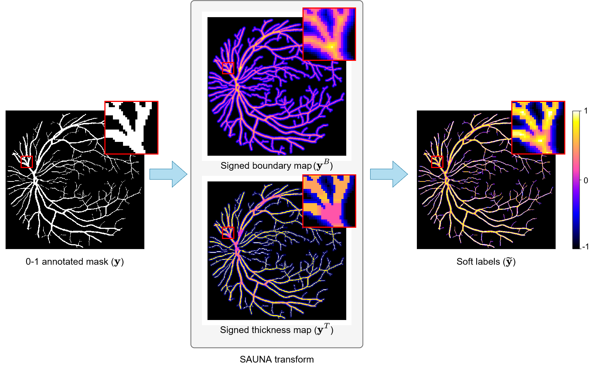

# SAUNA
SAUNA: Image-level Regression for Uncertainty-aware Retinal Image Segmentation

## Dependencies

We provide file `env.yaml` for dependencies.

## Installation
```bash
conda env create -f env.yaml
conda activate sauna
pip install -e .
```


## Split data
```bash
cd mlpipeline/utils
python split_fives.py
```

## SAUNA transform
```bash
cd mlpipeline/utils
python ./generate_uncertainty_masks.py --root <ROOT_DIR> --in_dir <GT_DIR>
```



## Training
```bash
python -m mlpipeline.train.run experiment=${EXP_NAME} \        
        model.params.cfg.arch=${ARCH_NAME}
```
where
- EXP_NAME: experiment setting can be `fives_uncertainty_sem_seg` (ours), `fives_patch_sem_seg` (for high-resolution-based methods), or `fives_whole_sem_seg` (for low-resolution-based methods).
- ARCH_NAME: architecture name can be `Unet`, `UnetPlusPlus`, `IterNet`, `CTF-Net`, `CE-Net`, `DUnet`, `FR-Unet`, `DA-Net`, or `Swin-Unet`.

## Evaluation
```bash
python -m mlpipeline.train.evaluate \
    --config=${EXP_NAME} \
    --output_dir=/path/to/inference_results/${EXP_NAME} \
    --log_dir=/path/to/eval/${EXP_NAME} \
    --visual_dir=/path/to/visuals \
    --metadata_path=/path/to/test_split.pkl \
    --dataset_name=${DATASET} \
    --seeds=${SEEDS} \
    --folds=0,1,2,3,4
```
where
- DATASET: is either `FIVES`, `STARE`, `DRIVE`, `CHASEDB1`, or `HRF`.

